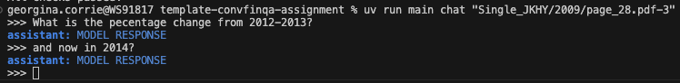

# ConvFinQA Assignment

## Get started
### Prerequisites
- Python 3.12+
- [UV environment manager](https://docs.astral.sh/uv/getting-started/installation/)

### Setup
1. Clone this repository
2. Use the UV environment manager to install dependencies:

```bash
# install uv
brew install uv

# set up env
uv sync

# add python package to env
uv add <package_name>
```

### [optional] Use CLI to chat

We have created a boilerplate cli app using [typer](https://typer.tiangolo.com/) (sister of fastapi, built on click) so there is a simple chat interface, which you can extend to meet your needs if you so choose.  By default the chat responds with a standard message as shown below.


We've installed the app as a script, so you can run it with:
```bash 
uv run main
```
or you can use the longer form:
```bash
uv run python src/main.py
```

How to *chat*:
```bash
uv run main chat <record_id> 
```
[](figures/chat.png)  

## How To Run

### 1) Install dependencies
```bash
uv sync
```

### 2) Configure environment
Create a `.env` file in the project root and set your model/API config.

Example:
```env
API_KEY=<your_api_key>
RAG_MODEL=<your_model_name>
```

### 3) Validate and profile data
```bash
uv run main load-data
uv run main profile-data
```

### 4) Run chat
```bash
uv run main chat <record_id>
```

Example:
```bash
uv run main chat "Single_AMT/2005/page_105.pdf-4"
```

### 5) Run deterministic evaluation
```bash
uv run main eval-accuracy --sample-records 25 --history-mode self --per-turn-jsonl-path reports/eval_self_turns.jsonl
```

### 6) Run oracle evaluation (upper bound)
```bash
uv run main eval-accuracy --sample-records 25 --history-mode oracle --per-turn-jsonl-path reports/eval_accuracy_turns.jsonl
```

### 7) Run unit tests
```bash
python -m unittest tests.test_answer_service_deterministic tests.test_evaluation_deterministic -v
```

## Report

See [REPORT.md](REPORT.md) for the full analysis covering problem framing, architecture decisions, evaluation design, results, and future work.
