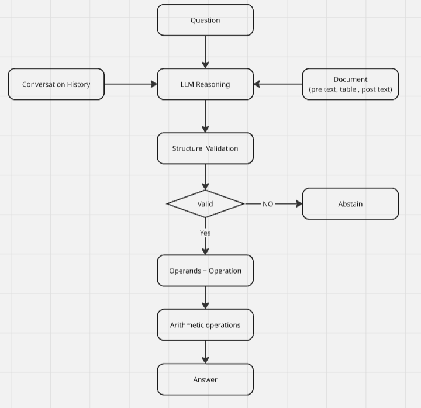

# ConvFinQA Report

## 1) Problem Framing
Before diving deeper into dataset, at a high-level, I was thinking this task could be broken into two parts:

1. Finding the right financial context.
2. Doing multi-turn numerical reasoning on top of that context.

However, After data evaluation I decided not to add a full RAG pipeline for this assignment because:
- Each record is relatively small (around a couple thousand tokens),
- The table structure is already included in the record,
- Modern LLM context windows can handle this directly.

After evaluation, this task could be thought of as a multi-turn financial QA over a single record.

For each conversation, the system needs to:
- read financial context from the record,
- pick the right numeric operands,
- do arithmetic correctly,
- and carry conversational references across turns (like "that", "this value", "difference", etc.).

Hence, I can focus effort on reasoning correctness and evaluation quality.

## 2) RAG Decision and What I Would Do in Production

For this assignment: no external retriever.

In production with larger corpus, I would split the problem into two isolated layers:

1. Retrieval quality- Did we fetch the right evidence?
2. Reasoning quality- Given correct evidence, did we compute the correct answer?

Retrieval metrics I would use:
- Recall@K
- Hit@K
- NDCG@K

Reasoning/grounding metrics I would use:
- Numeric match (deterministic)
- Answer relevancy
- Faithfulness
- Contextual precision
- Contextual recall

The main idea is to have metrics for each failure points in the pipeline.By that I meant if retrieval is weak, reasoning scores become noisy. If retrieval is strong and reasoning is weak, then model/program planning is the bottleneck. Hence, its important to measure precision at each point in isolation to have a baseline metric which can help up improve.

## 3) Model Selection Journey

Due to limited free tier availability of resources, I treated model choice as an engineering tradeoff (cost, quota, reliability), not the core research contribution. However, I did evaluated using latest models which are great of financial reasoning. (example - gemini-flash-3.5, This model provides only 20 RDP per day on free tier). The model chosen for finding metrics mentioned below is `Gemma-4-31b-it` (This provides 1500 RDP per day which is suitable for running seed tests required)

My path:
- Started from leaderboard intuition in hugging face and lightweight open options.
- Tried smaller local models first via ollama (e.g., llama3.2 class) because of cost and hardware limits (FYI, this can run on 2GB RAM).
- Observed they were acceptable on simple one-hop turns but degraded on multi-hop arithmetic/follow-up chains.
- Switched to larger hosted models for better reasoning stability under quota constraints. (Started with gemini flash 3.5 than came down to gemma due to RDP limitations)

Early baseline signal was low on strict numeric accuracy, which confirmed that prompt+planning+evaluation needed work, not just model swap.

## 4) Architecture Decisions

I initially considered a Clean Architecture because it separates stable domain logic from infrastructure concerns. After evaluating the scope of the assignment, I concluded that a flatter project structure provided sufficient simplicity while maintaining clear separation of concerns.

The proposed layers were:

- Domain - Business Domain (models, schema's, errors)
- Application - Business Rules 
- Infrastructure - I/O

## 5) Steps Followed



### 5.1) Data Loading, Validation and Preprocessing

The first step was to load the raw dataset into memory. This is necessary to start profiling data.

use this command to load data:

```uv run main load-data```

loaded data set contains below records:

```
train records: 3035
dev records: 421
```

Before starting work on reasoning, I validated data contracts and profiling outputs. This was important because evaluation is only meaningful when dataset integrity is verified. This gave me information about empty fields, null checks and missing ground truth

Use this command to get data profile
```
uv run main profile-data
```

####  Key Findings

- Two known records had turn alignment mismatch and were quarantined.

```
"Double_ADBE/2014/page_70.pdf",
"Single_ETR/2016/page_144.pdf-4"
```
- 184 empty/null-like table cells were found across the dataset. These were kept as-is and tracked, not silently dropped.
- No executed answers were empty. 40 turns (~0.3%) had non-numeric answers (yes/no booleans), which the scorer handles with a string-equality fallback rather than numeric matching.
- Most answers are numeric; boolean answers are a small minority and get a separate handling path.
- Turn counts per conversation range from 1 to 9 (avg ~3.5). This is a key finding for evaluation design: because turn counts vary, the eval scores **all** turns of each sampled record rather than a fixed number, so it does not systematically exclude the harder deep turns.

Data-integrity handling: two records with turn-array misalignment are quarantined by ID (documented above), and one record (`Single_AMT/2010`) was found during sampling to have lossy table flattening that made its gold answers unreachable — flagged for exclusion rather than silently absorbed. All findings are tracked in the profiling report.

I have added data evaluation report under reports/profile-data.json

#### NOTE: For this assignment, I chose strict validation so downstream results are easier to trust.
In a production ongoing pipeline, I would use non-blocking ingestion:
- emit structured logs/alerts,
- skip and log unhealthy records.

### 5.2) Method Implemented

LLMs are unreliable at multi-step arithmetic but strong at reading tables and identifying which values a question refers to. The method splits those two jobs: the model does extraction and planning only, and all arithmetic runs in Python outside the model.

Importantly, the model does **not** emit a program string that is then parsed. Generation is schema-constrained at the decoder (native structured output), and the result is validated as a typed Pydantic object before anything executes. There is no tokenizer, grammar, or regex applied to model output anywhere in the pipeline — the failure mode of parsing a custom program-language (the original paper's approach) is structurally absent here.

#### 5.2.1) Structured Reasoning Plan

The model returns a typed plan validated against a Pydantic schema, not a free-text program:

- `operands`: named numeric values extracted from the record or from prior turns.
- `operations`: an ordered list of steps, each with a `step_id`, an `op` restricted by a `Literal` type to a **closed set of five** (`add`, `subtract`, `multiply`, `divide`, `percent_change`), and `args` referencing operand names or earlier step ids.
- `final_step`: the step that produces the answer.
- `status`: `ok` or `insufficient_context`.

Two safety paths follow from this:

1. If the record lacks sufficient evidence, the model returns `status: insufficient_context` and the system abstains.
2. If the model's output is structurally invalid, Pydantic validation rejects it, the failure is logged with a typed failure category, and the system abstains rather than crashing or guessing.

This is the same pattern as modern function calling — a constrained operation vocabulary, generated under schema constraint and executed deterministically. It keeps the paper's separation of reasoning from arithmetic while removing the brittleness of generating and parsing DSL program strings, where a single malformed token loses the turn.

Benefits observed: no hallucinated arithmetic, failures attributable to a specific stage, and safe degradation instead of confident wrong answers.

#### 5.2.2) Conversation Handling

ConvFinQA turns are dependent: later questions refer to earlier ones ("what was the difference?", "what is that as a percentage?"). Handling this correctly is the core of the task, so history is treated as a first-class input.

- **Full conversation history is accumulated** for every turn. No turn window or truncation is applied.
- Each history entry stores the question together with a **normalized numeric anchor** of the answer, so prior values re-enter the next prompt as usable operands rather than as prose to be re-read.
- **Abstentions are recorded explicitly** as a short no-answer marker, so a failed turn propagates as a known gap rather than as misleading text.
- Values from prior answers are **valid operands** in the plan schema, which is what allows a turn like "what percentage of that total?" to be planned at all.

Turn handling is verified empirically, not asserted. Evaluation runs in two history modes on identical turns (§6.2), which makes three checks possible: turn-1 and turn-2 accuracy are **identical across both modes** (a required property when no history exists to differ, and a validity check on the harness itself); oracle accuracy at turn depth 3 is **100%** (impossible with broken reference resolution); and the oracle-to-self gap is small (§7), meaning errors barely propagate through the conversation. The residual weakness is on the deepest multi-step turns, which is a reasoning-chain limitation rather than a history-mechanics defect — it persists even when history is perfect.

#### 5.2.3) Numeric Normalization

Scoring uses deterministic normalization so that formatting differences do not fail correct answers:
- numeric extraction (strips `$`, commas, and other formatting),
- percent/ratio compatibility (gold `0.528` and a predicted `52.8%` are treated as equal, and vice versa — this mirrors the benchmark's own convention, since the dataset stores percentages inconsistently),
- a string-equality fallback for the small number of non-numeric (yes/no) answers.

This is intentionally practical for benchmark-style evaluation where formatting inconsistency is common.

Separately, one prompting fix belongs to the reasoning side rather than normalization: on some questions the model chose subtraction where a ratio was required ("what portion does X represent?"). This was addressed with contrast few-shot examples that draw the boundary between difference-phrasing and ratio-phrasing, which improved accuracy on those turns.

**Data quality note.** During sampling, `Single_AMT/2010` was found to have lossy table flattening that destroyed a year column, making 3 of its 4 gold answers unreachable from the provided evidence. This record is flagged for exclusion rather than charged against model accuracy; a systematic detection pass over the full dataset is listed under future work.

## 6) Evaluation Design

### 6.1 Primary Metric

The main metric I used is deterministic `normalized_numeric_match` per turn.

I chose this because for this task the final requirement is still numeric correctness. If the model gives the right grounded number, that matters more than having a fluent explanation.

For evaluation, I used:
- seeded random sampling from dev,
- all turns per selected record,
- bootstrap 95% CI over per-turn outcomes,
- accuracy by turn depth,
- per-turn JSONL logs for debugging.

I also used `executed_answers` as gold for scoring instead of `conv_answers`. The reason is that `executed_answers` are the exact program results, while `conv_answers` are sometimes rounded display values. If I score against rounded answers, a correct prediction can still look wrong near tolerance boundaries.

### 6.2 History Modes

I kept two evaluation modes:
- `oracle`: previous gold answer is passed into history,
- `self`: previous model answer is passed into history.

I wanted both because they tell me different things.

`oracle` shows whether the model can solve the current turn when history is perfect.

`self` shows the real deployed behavior, where one wrong answer can affect the next turn.

The difference between these two is useful because it shows how much performance is lost due to error cascade.

### 6.3 DeepEval Diagnostics

I implemented DeepEval-based diagnostics as secondary signals, not as the main reported result. This is because these metrics are more for RAG pipeline however, we only wanted to measure reasoning for this task.

These include:
- answer relevancy,
- faithfulness,
- contextual precision,
- contextual recall.

I did not make them the headline metric because they are slower, non-deterministic, and in this assignment I am not evaluating a retrieval ranking system. For this architecture, deterministic numeric accuracy is the more reliable benchmark.

### 6.4 Initial Chunking + DeepEval Run (Earlier Iteration)

I had an earlier run where I evaluated retrieval + reasoning together using chunking metrics and DeepEval outputs.

#### Config and Coverage

| Field | Value |
|---|---|
| split | dev |
| sample_records | 10 |
| turns_per_record | 2 |
| top_k | 5 |
| variant | deepeval |
| evaluated_records | 10 |
| evaluated_turns | 18 |
| total_attempted_turns | 20 |

#### Retrieval Metrics (Earlier Run)

| Metric | Value |
|---|---:|
| recall_at_k | 0.45 |
| hit_at_k | 0.45 |
| ndcg_at_k | 0.3574 |

#### Reasoning Metrics (Earlier Run)

| Metric | Value |
|---|---:|
| answer_relevancy | 0.7593 |
| faithfulness | 0.7222 |
| contextual_precision | 0.509 |
| contextual_recall | 0.7978 |

Why I changed approach after this:
- this setup was still tied too much to expected-output style matching,
- and in financial QA, numeric formats vary (for example 500 vs 500.0 vs scaled formats),
- so retrieval relevance judged by string form is not robust enough.

The sound way to build retrieval ground truth for this dataset would be evidence-level annotations — mapping each turn's `turn_program` operands to the specific table cells and text sentences that contain them (the qrels approach described in §2), rather than string-matching the final answer. This earlier retrieval run is retained only as an appendix; it measures a component the final architecture does not contain.

## 7) Results

Both runs use the same seeded dev sample (seed 42, 25 records, all turns, 86 turns total), so the comparison is **paired** — every turn is compared against itself across history modes. Gold source is `executed_answers`; scoring is deterministic `normalized_numeric_match` with no LLM judge.

### 7.1 Headline: paired oracle vs. self history

| Metric (n = 86 turns, 25 dev records, seed 42) | Oracle history | Self history |
|---|---:|---:|
| normalized_numeric_match | **0.8488** | **0.8140** |
| 95% bootstrap CI | [0.7674, 0.9186] | [0.7326, 0.8953] |

### 7.2 Accuracy by turn depth

| Turn depth | Oracle | Self | n |
|---|---:|---:|---:|
| 1 | 0.84 | 0.84 | 25 |
| 2 | 0.84 | 0.84 | 25 |
| 3 | 1.00 | 0.875 | 16 |
| 4+ | 0.75 | 0.70 | 20 |

### 7.3 What the numbers say

**Error cascade is small.** Feeding the model its own answers instead of gold costs 3.5 points — roughly three turns out of 86. The system degrades gracefully under its own errors, helped by abstentions propagating as explicit markers rather than as wrong values. The two confidence intervals overlap heavily, so the honest reading is that the cascade cost is small and not clearly separable from sampling noise at this sample size.

**The harness validates itself.** Turn-1 and turn-2 accuracy are identical across modes, as they must be when no history exists to differ. This is direct evidence that conversation history is wired correctly.

**Depth alone is not the difficulty; multi-hop chains are.** Accuracy is stable through depth 3 (100% oracle) and only falls at depth ≥4. Turn-1 misses are extraction/lookup errors rather than reasoning failures, so the residual frontier is long multi-step programs, not conversational depth as such.

**Sample size.** n = 86 turns from 25 records; the ±7-point interval width is a direct consequence, and a larger sample would tighten it (noted in future work).

## 8) Honest Assessment: Strengths and Limitations

### 8.1) Strengths

- Structured arithmetic reduced calculation mistakes significantly.
- Deterministic evaluation made debugging much easier.
- Unit and percent normalization removed many false negatives from scoring.
- Per-turn logs made it possible to inspect exactly where the system failed.

### 8.2) Limitations

- The residual weakness is on the deepest turns: accuracy holds at 84–100% through turn 3 and falls to 75% (oracle) at depth ≥4 (n=20). This is a long multi-step reasoning-chain limitation, not a conversation-history defect — turn handling itself is sound (identical turn-1/2 accuracy across modes, 100% at depth 3, small oracle-to-self gap; §7).
- Some failures come from the model not resolving whether a value should be looked up directly or derived (see error analysis) — this is genuine ambiguity in the questions, and the system tends to abstain rather than guess, which is the safer failure direction.
- Some dataset records are themselves noisy or partially broken (e.g. lossy table flattening), which affects trust in raw accuracy on those records.
- Sample size is modest (86 turns / 25 records); the confidence intervals reflect this. A larger sample would tighten the estimate.
- This solution works well for single-record context; it is not a full production retrieval system (by design — see §2).

So overall, I would say the system is reasonably strong for grounded single-record numerical QA, but it is still not robust enough for fully reliable financial use without human review.

## 9) What I Would Do With More Time

If I had more time, these are the main things I would work on:

1. Add better retry handling for provider-side 5xx errors so evaluation runs are more stable.
2. Improve follow-up handling for references like "that", "this value", and "the previous one".
3. Add more explicit failure categories in reporting so it is easier to separate reasoning errors from data issues and normalization issues.
4. Do another round of dataset cleaning and quarantine more broken records automatically.
5. If the dataset grows to multiple documents, then add a proper retrieval layer and evaluate retrieval separately from reasoning.
6. If dataset grows/changes implement qlora/lora technique to train models.
7. Add a lightweight second LLM cross-check to verify that extracted operands actually appear in the provided document/context.

I would also spend more time testing prompt format variations for tables, because table serialization clearly affects how well the model reasons over rows and sections.

## 10) Final Note

My main focus in this assignment was not just to get answers, but to build something that is easy to inspect, debug, and improve.

That is why I prioritized:
- validating data first,
- using structured reasoning instead of free-form arithmetic,
- keeping evaluation deterministic,
- and logging enough detail to understand failures clearly.

This gave me a stable baseline, a fair evaluation setup, and a clear path for what to improve next.